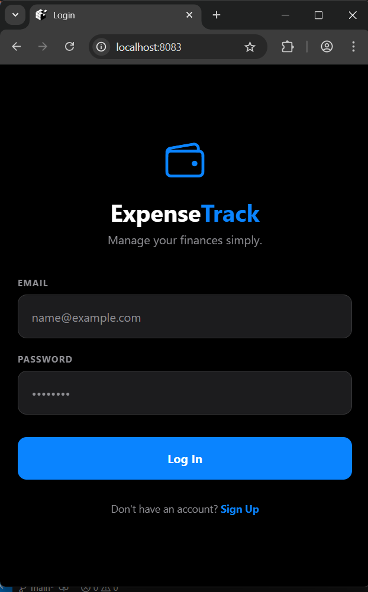
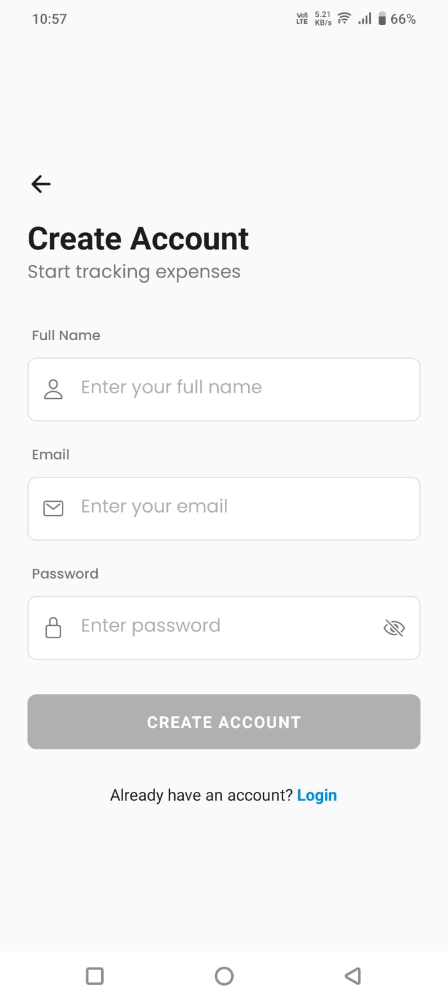
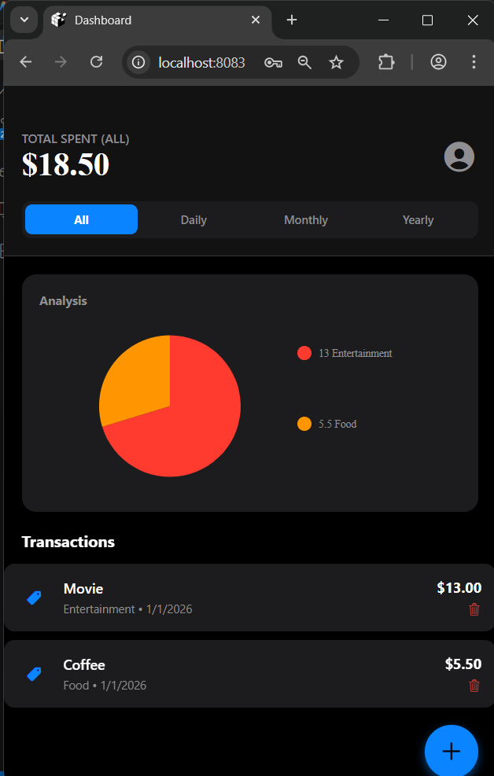
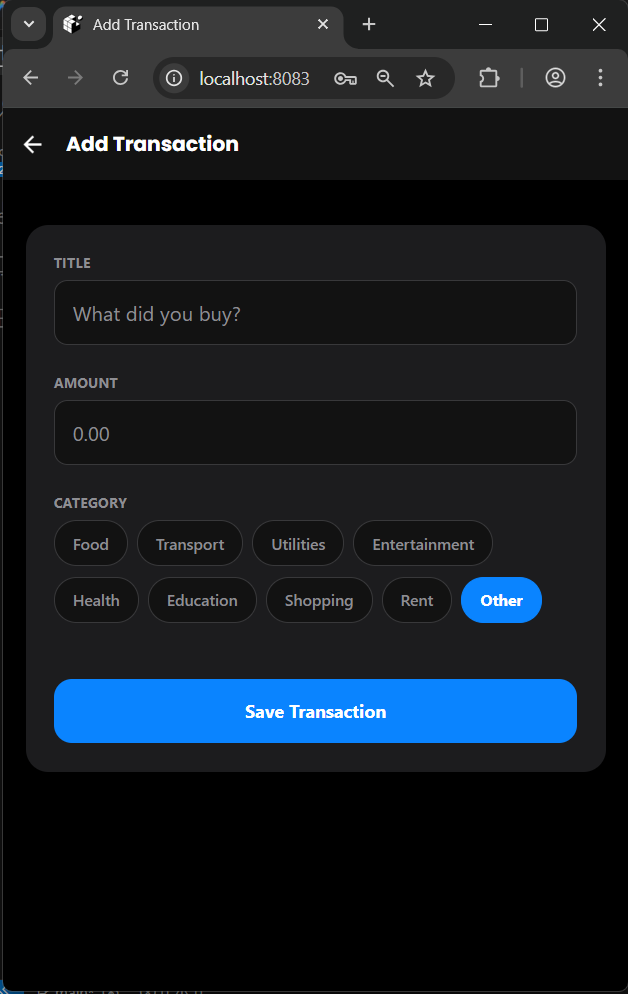
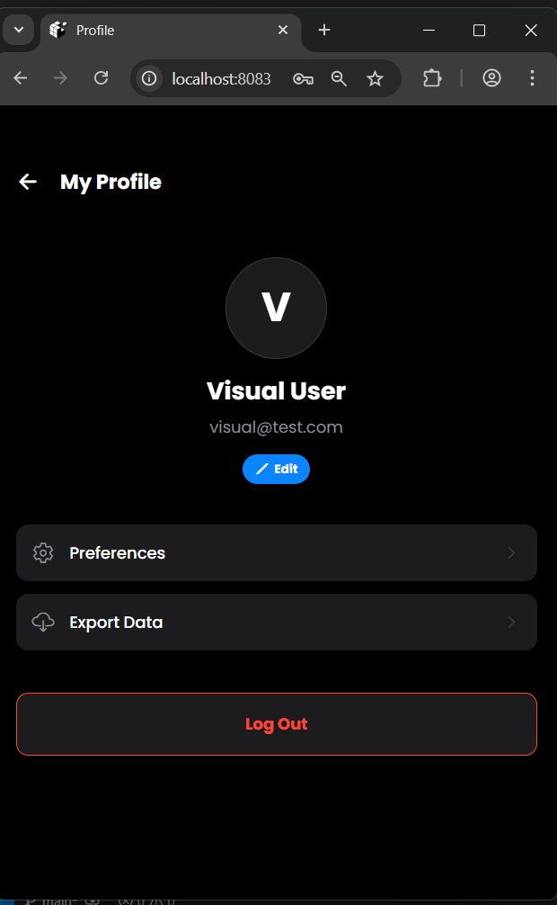

<div align="center">

  <h1>� Expense Tracker Pro</h1>

  <p>
    <strong>A Premium, OLED-Ready Financial Companion for Modern Life</strong>
  </p>

  <p>
    <a href="#-overview">Overview</a> •
    <a href="#-features">Features</a> •
    <a href="#-screenshots">Screenshots</a> •
    <a href="#-getting-started">Getting Started</a> •
    <a href="#-tech-stack">Tech Stack</a> •
    <a href="#-marketing">Author</a>
  </p>

  <p>
    
    
    
    
    
  </p>
</div>

<br />

## 📖 Overview

**Expense Tracker Pro** is not just another finance app; it's a Statement. Built with a "Mobile-First, Design-First" philosophy, this application leverages the power of the **MERN Stack** (MongoDB, Express, React Native, Node.js) to deliver a seamless, buttery-smooth experience.

Featuring a **True Black (OLED)** theme, it saves battery on modern devices while looking incredibly sleek. From real-time data visualization to secure authentication, every pixel has been crafted for delight.

---

## ✨ Features

<table>
  <tr>
    <td>🎨 <strong>OLED Dark Theme</strong></td>
    <td>True black (#000000) UI optimized for modern displays, reducing eye strain and saving battery.</td>
  </tr>
  <tr>
    <td>🔐 <strong>Secure Auth</strong></td>
    <td>Bank-grade authentication using JWT and bcrypt encryption for your peace of mind.</td>
  </tr>
  <tr>
    <td>📊 <strong>Smart Analytics</strong></td>
    <td>Interactive Pie Charts with vibrant, distinct color palettes for instant financial clarity.</td>
  </tr>
  <tr>
    <td>📅 <strong>Time Filters</strong></td>
    <td>Instant toggling between <strong>Daily</strong>, <strong>Monthly</strong>, and <strong>Yearly</strong> spending views.</td>
  </tr>
  <tr>
    <td>👤 <strong>Profile Management</strong></td>
    <td>Full control over your data with Profile Editing and Data Export capabilities.</td>
  </tr>
  <tr>
    <td>⚡ <strong>Performance</strong></td>
    <td>Buttery smooth 60fps animations powered by <code>react-native-reanimated</code>.</td>
  </tr>
</table>

---

## 📸 Screenshots

<div align="center">
  <table>
    <tr>
      <td align="center">
        <br />
        <b>Premium Login</b>
      </td>
      <td align="center">
        <br />
        <b>Secure Registration</b>
      </td>
      <td align="center">
        <br />
        <b>Analytics Dashboard</b>
      </td>
    </tr>
    <tr>
      <td align="center">
        <br />
        <b>Add Transaction</b>
      </td>
      <td align="center">
        <br />
        <b>User Profile</b>
      </td>
      <td align="center">
        <b>...and more!</b>
      </td>
    </tr>
  </table>
</div>

---

## 🛠️ Tech Stack

<details>
  <summary><strong>📱 Mobile App (Frontend)</strong></summary>
  
  - **Core**: React Native (Expo SDK 50)
  - **Styling**: `StyleSheet` & `expo-linear-gradient`
  - **Typography**: Poppins (Google Fonts)
  - **Navigation**: React Navigation v6
  - **Charts**: `react-native-chart-kit`
  - **State Management**: React Context API
</details>

<details>
  <summary><strong>🔌 API (Backend)</strong></summary>
  
  - **Server**: Node.js & Express
  - **Database**: MongoDB Atlas
  - **ODM**: Mongoose
  - **Authentication**: JWT (JSON Web Tokens)
  - **Security**: Colors, Dotenv
</details>

---

## 🚀 Getting Started

Follow these steps to get the project running on your local machine.

### Prerequisites

*   **Node.js** (v16.0.0 or higher)
*   **npm** or **yarn**
*   **Expo Go** app on your phone (or Android Studio/Xcode for emulation)

### Installation

#### 1. Clone the Repository
```bash
git clone https://github.com/HemachandRavulapalli/Expense-Tracker.git
cd Expense-Tracker
```

#### 2. Backend Setup
```bash
cd backend
npm install

# Create .env file
echo "PORT=5000" > .env
echo "MONGO_URI=your_mongodb_connection_string" >> .env
echo "JWT_SECRET=your_jwt_secret" >> .env

# Start Server
npm start
```

#### 3. Frontend Setup
```bash
cd mobile-app
npm install

# Start App
npx expo start
```

> **Note**: Use the `w` key in the terminal to open the web version, or scan the QR code with your phone.

---

## 📂 Project Structure

```bash
Expense-Tracker/
├── 📂 backend/                 # Node.js API Server
│   ├── 📂 models/             # Database Schemas
│   ├── 📂 routes/             # REST API Routes
│   └── 📄 server.js           # Server Entry Point
│
├── 📂 mobile-app/              # React Native Client
│   ├── 📂 api/                # API Config (Axios)
│   ├── 📂 assets/             # Images & Fonts
│   ├── 📂 context/            # Global State (Auth)
│   ├── 📂 screens/            # UI Screens
│   ├── 📄 App.js              # Main Application
│   └── 📄 theme.js            # Design System
│
└── 📂 Screenshots/             # Documentation Images
```

---

## 🔗 Author

<div align="center">
  
  **Hemachand Ravulapalli**

  [](https://github.com/HemachandRavulapalli)
  [](https://linkedin.com/in/hemachand-ravulapalli)

</div>

---

<div align="center">
  <sub>Built with ❤️ for Mobile App Development Assignment</sub>
</div>
