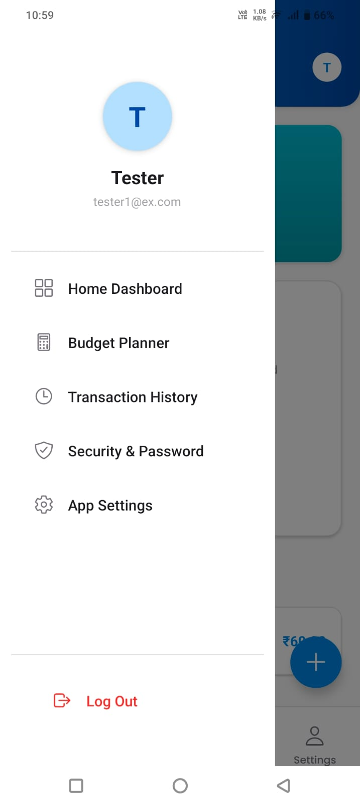
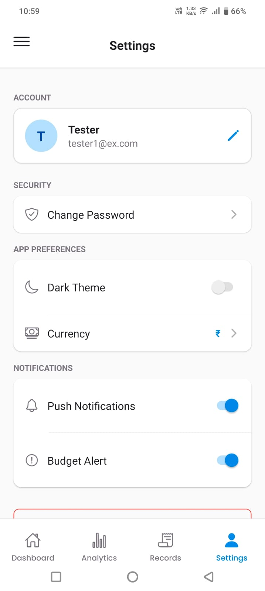

<div align="center">

  

  # 💎 Expense Tracker Pro
  **A Premium, OLED-Ready Financial Ecosystem for Modern Mobility**

  [](https://reactnative.dev/)
  [](https://expo.dev/)
  [](https://nodejs.org/)
  [](https://www.mongodb.com/)
  <br/>
  [](https://GitHub.com/HemachandRavulapalli/Expense-Tracker/graphs/commit-activity)
  [](https://opensource.org/licenses/MIT)

</div>

---

## 🚀 Overview

**Expense Tracker Pro** is a sophisticated financial management solution built for the modern user. Ditching the generic "spreadsheet" look, we've engineered a high-performance mobile application that focuses on **Aesthetics, Security, and Longevity**.

Built with the **MERN Stack**, it features a true OLED-optimized interface, bank-grade authentication, and intelligent data visualization.

---

## ✨ Premium Features

### 🎨 Visual Excellence
- **OLED Dark Mode**: True black design (#000000) for maximum battery efficiency and eye comfort.
- **Glassmorphic Elements**: Subtle transulency and smooth gradients for a premium feel.
- **Smooth Animations**: 60fps transitions powered by `react-native-reanimated` and `react-native-gesture-handler`.

### 🔐 Advanced Security & Sessions
- **30-Day Sessions**: Extended JWT lifespan reduces annoying frequent logouts.
- **Silent Refresh**: Automatic background token rotation every time you open the app.
- **Biometric Ready**: Architecture prepared for secure, rapid access.

### 📊 Smart Finance
- **Interactive Analytics**: Dynamic Pie Charts and lists that update in real-time.
- **Granular Budgeting**: Set monthly overall limits or specific category-wise budgets.
- **Budget Alerts**: Local notifications keep you informed before you overspend.

---

## 📸 App Showcase

<div align="center">
  <table>
    <tr>
      <td align="center">
        <br />
        <sub><b>Premium Entry</b></sub>
      </td>
      <td align="center">
        <br />
        <sub><b>Secure Auth</b></sub>
      </td>
      <td align="center">
        <br />
        <sub><b>Analytics</b></sub>
      </td>
    </tr>
    <tr>
      <td align="center">
        <br />
        <sub><b>Dynamic Menu</b></sub>
      </td>
      <td align="center">
        <br />
        <sub><b>Quick Entry</b></sub>
      </td>
      <td align="center">
        <br />
        <sub><b>Smart Limits</b></sub>
      </td>
    </tr>
  </table>
</div>

---

## 🛠️ Technical Architecture

### **Frontend Mobility**
- **Framework**: Expo SDK 54 (Latest)
- **Engine**: React Native 0.81 (New Architecture Enabled)
- **Navigation**: React Navigation v7 (Stack, Tabs, & Drawer)
- **State**: React Context API with persistent AsyncStorage.

### **Backend Infrastructure**
- **Language**: Node.js & Express
- **Database**: MongoDB (NoSQL) for flexible schema.
- **Auth**: JWT with `bcryptjs` hashing.
- **Hosting**: Prepared for Vercel/Render deployment.

---

## ⚙️ Installation & Setup

### **1. Clone the Source**
```bash
git clone https://github.com/HemachandRavulapalli/Expense-Tracker.git
cd Expense-Tracker
```

### **2. Backend ignition**
```bash
cd backend
npm install
# Create .env with MONGO_URI and JWT_SECRET
npm start
```

### **3. Mobile Bootup**
```bash
cd mobile-app
npm install
npx expo start --go
```

---

## 🌍 Connect With Me

<div align="center">

**Hemachand Ravulapalli**

[](https://github.com/HemachandRavulapalli)
[](https://www.linkedin.com/in/rhemachand/)

---
  
<sub>Built with precision for the next generation of financial tracking.</sub>

</div>
